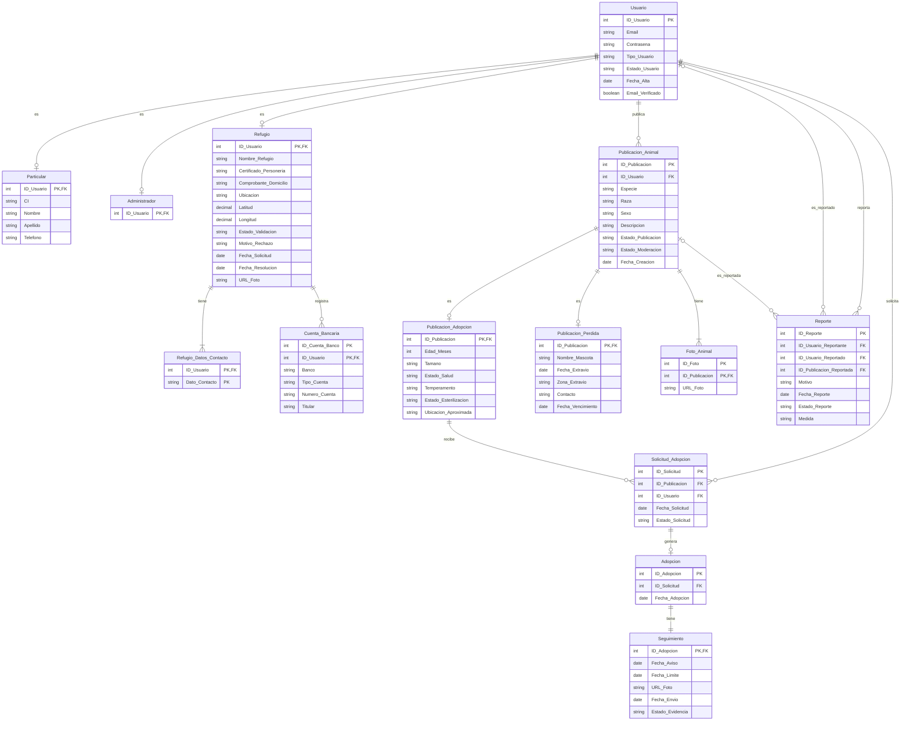

# Modelo de datos (DER)

Versión con `Publicacion_Animal` separada en dos subtipos (`Publicacion_Adopcion` y `Publicacion_Perdida`). La versión que sigue el pasaje a tablas original del documento integrador es [`AdoptaUY_DER.mmd`](AdoptaUY_DER.mmd).

Notas:
- La ISA de `Usuario` (Particular, Refugio, Administrador) es total y disjunta; Mermaid no la dibuja, por eso se muestra como tres relaciones 1 : 0..1.
- `Reporte` apunta a un usuario **o** a una publicación (una de las dos FK queda nula).

